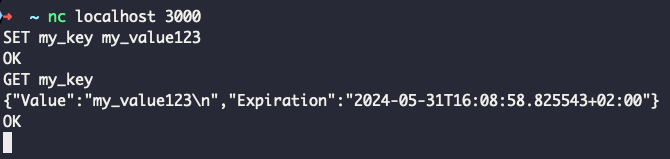
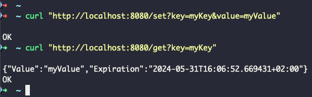

By Agostinho Neto - acneto@me.com - https://www.linkedin.com/in/acnetto/

## Overview, architecture and code design.

- This project use principles of hexagonal architecture. The main idea is to separate the business logic from the infrastructure.
- Functions without external dependencies are easier to test and maintain.
- The project is divided into 2 main parts:
    - `/cache` folder: cache engine: TCP server that can be accessed by any client that supports TCP connections. This is the core of the project.
    - `/api` folder: HTTP server that will redirect HTTP requests to the cache engine.
      - Cache engine and HTTP server are totally isolated services. They communicate through TCP.


  - Keeping the cache engine and HTTP API as isolated services brings benefits, like:
    - Independent scaling.
    - Independent deployment.
    - Fault Isolation.
    - Separation of concerns.

### How to run?

```shell
make run-cache-engine
```
After `run-cache-engine` you can connect like:

```shell
nc localhost 3000
```
Then send commands `SET` and `GET`

```shell
SET my_key my_value
GET my_key
````


HTTP API:

Make sure `run-cache-engine` is running then start the web api:

```shell
make run-web-api
```

Then send commands like:

```shell
curl "http://localhost:8080/set?key=myKey&value=myValue"
curl "http://localhost:8080/get?key=myKey"  
```


### Unit tests
```shell
make test
````


